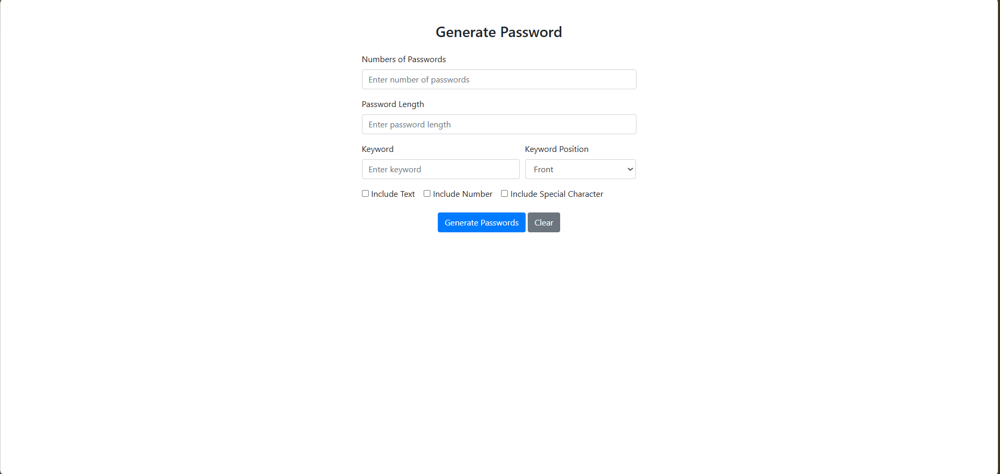
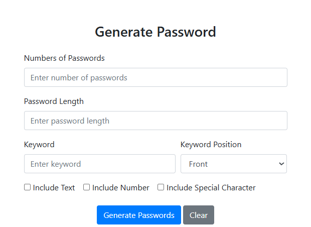
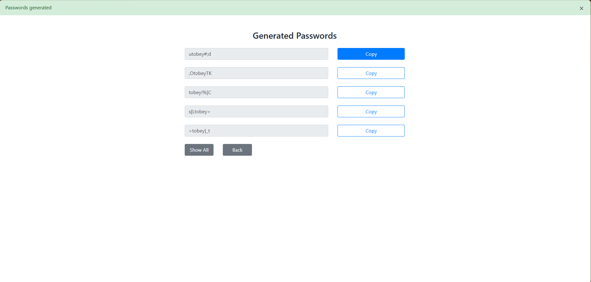

# 🔐 Flask Secure Password Generator

A robust and customizable web application for generating high-entropy passwords. Built with **Python (Flask)**, this tool is designed to balance security with usability, allowing users to create strong passwords that fit specific requirements or memorable patterns.

## 🚀 Project Overview

In an era where digital security is paramount, relying on weak passwords is a risk. This application provides a user-friendly interface to generate random, secure passwords. Unlike standard generators, it offers a unique **"Keyword Injection"** feature, allowing users to embed a specific word (prefix or suffix) to make the password easier to remember without compromising complexity.

## ✨ Key Features

* **📏 Granular Control:** Fully customizable password length and batch quantity (generate multiple passwords at once).
* **🔏 Keyword Integration:** Option to insert a custom "Keyword" at the beginning or end of the password, creating memorable yet strong passphrases.
* **🎛️ Smart Complexity:** Toggle specific character sets:
    * Uppercase & Lowercase Letters (A-Z, a-z)
    * Numeric Digits (0-9)
    * Special Symbols (!@#$%)
* **📱 Responsive Design:** Clean and mobile-friendly UI built with Bootstrap.

## 🛠️ Tech Stack

* **Backend:** Python 3, Flask Framework
* **Frontend:** HTML5, CSS3, Bootstrap
* **Version Control:** Git & GitHub

<p align="center">
  
  
  
</p>

1. **Clone the repository**

   ```bash
   git clone https://github.com/WuttikornFunk/Flask-Password-Generator.git
   ```

2.**Navigate to the project folder**
   
   ```bash
   cd Flask-Password-Generator
   ```

3.**Install dependencies**
   
   ```bash
   pip install flask
   ```

4.**Start the application**
   
   ```bash
   python main.py
   ```
Then open your browser and visit: http://127.0.0.1:5000


